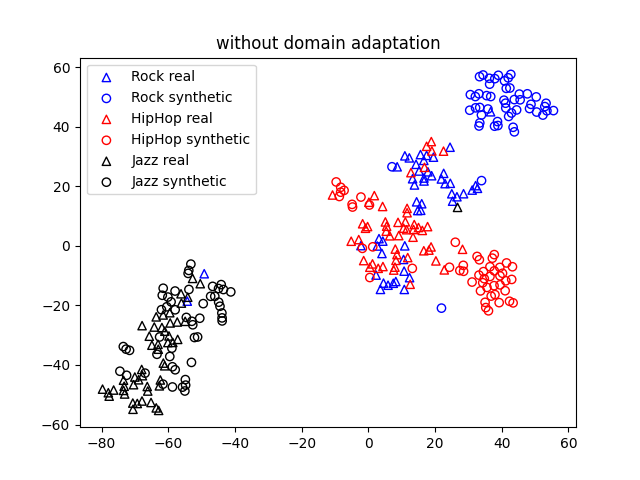
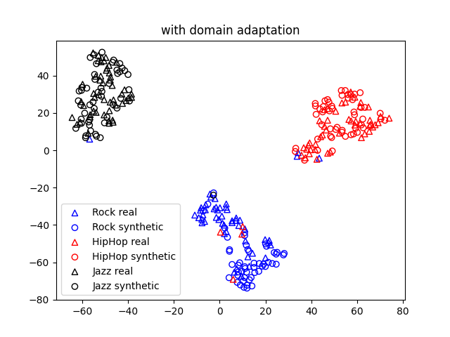

# Towards Training Music Taggers on Synthetic Data
This repository contains code accompanying our paper "Towards Training Music Taggers on Synthetic Data" (Kroher et al, 2024), 
which explores the potential of training music tagging system on synthetically generated music excerpts. 

Our paper is available
on [ArXiv](https://arxiv.org/abs/2407.02156) . 

## Overview

This initial study uses the GTZAN dataset, which is available for download [here](https://www.kaggle.com/datasets/andradaolteanu/gtzan-dataset-music-genre-classification). 

We compare different ways of incorporating synthetically generated music excerpts into the training process: 

* training on synthetic data only
* adding synthetic to real data 
* adding synthetic data via domain adaptation
* training on synthetic data and using transfer learning to real data
* training on synthetic data and fine-tuning on real data

In order to generate synthetic music excerpts, we implemented the following pipeline:

* Leverage OpenAI's [GPT-3 turbo](https://platform.openai.com/docs/models) to create genre-specific textual descriptions (i.e. "A lively instrumental Country track featuring twangy guitars and upbeat fiddle melodies, perfect for a barn dance.")
* Use these descriptions as text prompts to guide Meta's medium-sized [MusicGen](https://musicgen.com/) model to generate genre-specific music excerpts
* Train and evaluate the MusiCNN architecture for the tagging task using the different strategies outlined above.

For more detail and results, please read the [paper](https://arxiv.org/abs/2407.02156).

## Installation
Create a virtual environment and install the dependencies:

```python -m venv .venv```

```source .venv/bin/activate```

```pip install -r requirements.txt```
## Reproducing the results
Follow these steps to reproduce the results from our paper:

1. **Download the GTZAN Dataset**: Obtain the GTZAN music genre dataset, which contains 10 genres of music. You can download it here: https://www.kaggle.com/datasets/andradaolteanu/gtzan-dataset-music-genre-classification

2. **Generating music descriptions**
Create 10,000 text prompts for each genre using a large language model (we used ChatGPT 3.5 turbo).
Use the `generate_descriptions.py` script to generate text prompts using OpenAI's GPT-3 turbo.

3. **Generating synthetic data**
Use the generated text prompts to create genre-specific synthetic music using MusicGen's medium-sized model. This will result in a dataset of 100K audio files in total.
MusicGen is available via the [audiocraft](https://github.com/facebookresearch/audiocraft) library. 
Use `generate_synth_GTZAN.py` to generate the synthetic data.

4. **Data Splits**: Our code uses the [artist-filtered splits](https://github.com/julianofoleiss/gtzan_sturm_filter_3folds_stratified) of the GTZAN dataset which we added in the folder `artist_filtered_splits`.

5. **Extract Features**: 
The MusiCNN architecture takes the log-mel spectogram as input which you can extract and store with the `extract_features.py` script.

   - `--source-data`: Path to the synthetic data.
   - `--target-data`: Path to the real data (GTZAN validation split).

6. **Model Training**
Use the `train.py` script to train the model with the following arguments:

   - `--source-data`: Synthetic data embeddings.
   - `--target-data`: Human/GTZAN data embeddings.
   - `--mode`: Type of training (`src_only` train on synthetic data only, `trg_only` train on real data only, `both` train on synthetic and real data, `DA` train on synthetic and real data with supervised domain adaptation, `TL` employ Transfer Learning from synthetic to real data, and `FT` train on synthetic data and fine-tune to real data).

PS: The modes `TL` and `FT` both assume that you have already trained a model on the source (real-world) data already

### Visualising and analysing the results
You can run `plot_embeddings.py` to visualize an intermediate representation with and without domain adaptation

The plots should look like this:





Run `plot_confusion_matrices.py` script (pass the source and target data paths together with the model type) to plot the confusion matrix.


## Citation

If you are going to use this work as part of your research, please cite following paper: 

```
@inproceedings{kroher2024Towards,
  title={Towards training music taggers on synthetic data},
  author={N. Kroher and S. Manangu and A. Pkrakis},
  booktitle={Proceedings of the 21st International Conference on Content-based Multimedia Indexing},
  year={2024},
}
```


